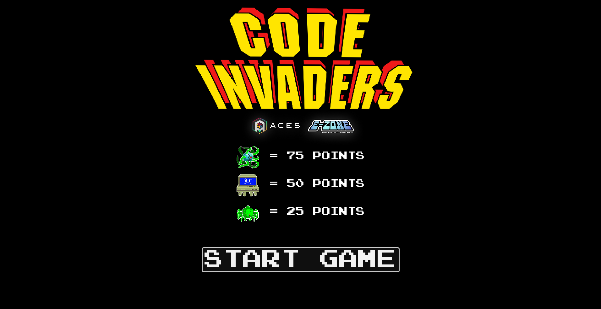
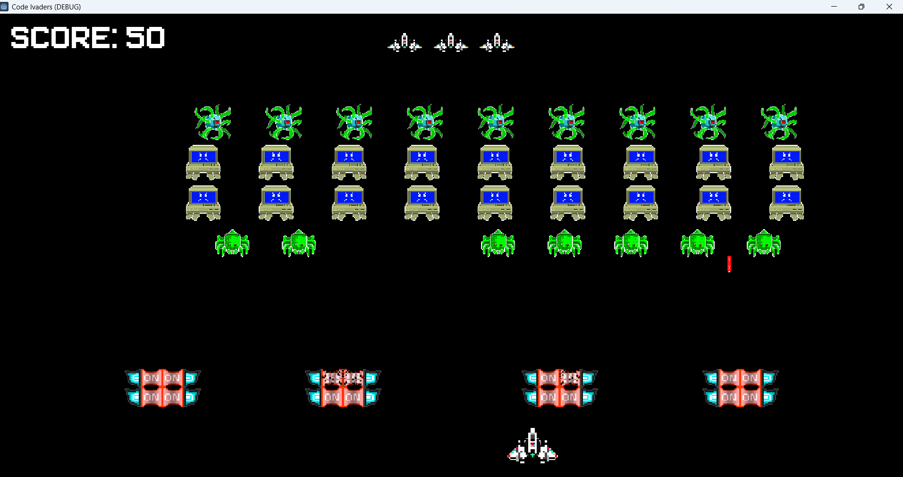
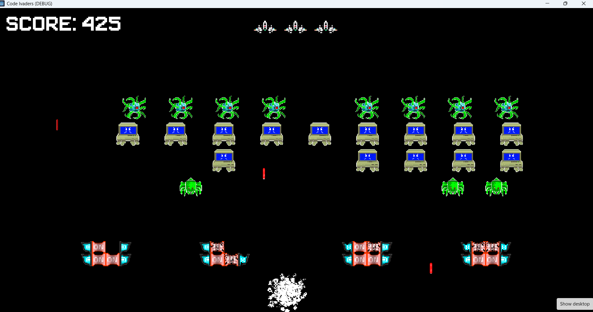
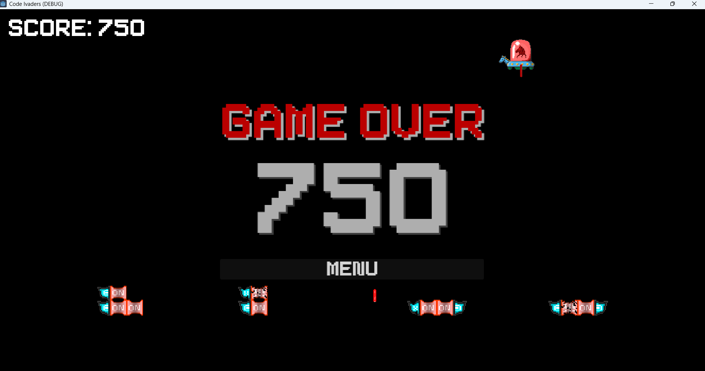

# Code Invaders 👾

Code Invaders is a retro-inspired arcade game developed as a standalone passion project. Built from the ground up in the Godot Engine, this title serves as a tribute to classic arcade shooters while incorporating a custom, tech-themed aesthetic for the ACES E-Zone. 

**Architectural Focus:** This project demonstrates practical game development skills within the **Godot Engine**. It highlights the use of a node-based architecture, GDScript for game logic, 2D physics and collision detection for projectiles, and dynamic state management for waves, scoring, and destructible environments.

## 🚀 Features
* **Classic Arcade Mechanics:** Smooth player movement and responsive shooting mechanics designed to mimic the nostalgic feel of vintage arcade cabinets.
* **Tiered Enemy Logic:** A grid of descending enemies with distinct visual designs and unique point values (25, 50, and 75 points).
* **Destructible Defenses:** Player shields that dynamically degrade and update their visual state as they absorb enemy projectiles.
* **Special Bonus Events:** A rare, high-speed UFO target that occasionally traverses the top of the screen for bonus points.
* **Visual Polish:** Implemented particle emitters for satisfying explosion effects upon player or enemy destruction.

## 🛠️ Built With
* Godot Engine
* GDScript
* Aseprite

## 💻 Visual Walk-through

<b>Title Screen:</b>  
The main menu showcasing the game's logo, E-Zone branding, and the enemy point value ledger. 

 
 
<b>Active Gameplay:</b>  
The core game loop featuring the player's ship, intact defensive shields, and the descending grid of tech-themed invaders. 

 
 
<b>Combat & Destruction:</b>  
Showcasing the particle explosion effects when the player is hit, alongside the visual degradation of the shield blocks. 

 
 
<b>Game Over State:</b>  
The final screen displaying the total accumulated score, options to return to the menu, and the rare UFO enemy visible in the top right. 

